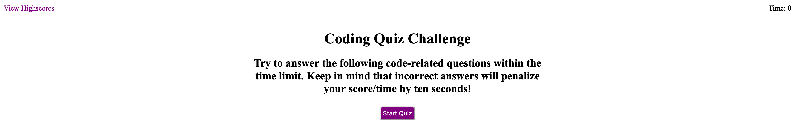

# Code Quiz

## Description
This is a timed quiz on JavaScript fundamentals that stores and resets high scores so that you can gauge your progress compared to your peers.

## License

  
This project is licensed under the MIT License.

For more information on this license, please visit [their website](https://www.mit.edu/~amini/LICENSE.md).

## Deployment
[Deployment Link](https://yyb613.github.io/code-quiz)

## Contact
If you have any questions, you can find me [here](https://yyb613.github.io/portfolio).
